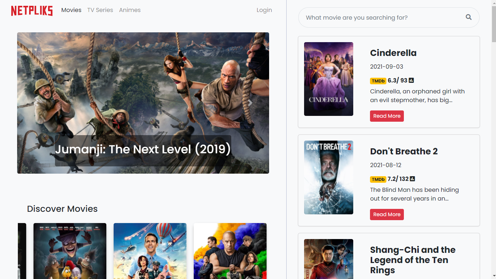
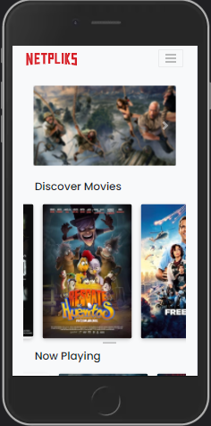

# Netpliks App - BFFWD Dicoding X IDCamp 2021

The Netpliks App is a JavaScript front-end client that communicates with the TMDB API.
This is a submission project for the [Front-End Web Development Fundamentals](https://www.dicoding.com/academies/163) class of the Dicoding X IDCamp 2021 program.


## Installation
1. Clone the repo
```bash
  https://github.com/diazamaliana/idcamp-bffwd-netpliks-app.git
  cd idcamp-bffwd-netpliks-app
```

2. Install with npm

```bash
  npm install 
```

3. Runs the app in development mode.

```bash
  npm run build
  npm run start-dev 
```
    
## Features

- Search movies features.
- Applying custom components.
- Using Bootstrap for styling.
- Responsive to mobile.

  
## Screenshoots
<p align="center">
  
   
</p>


  